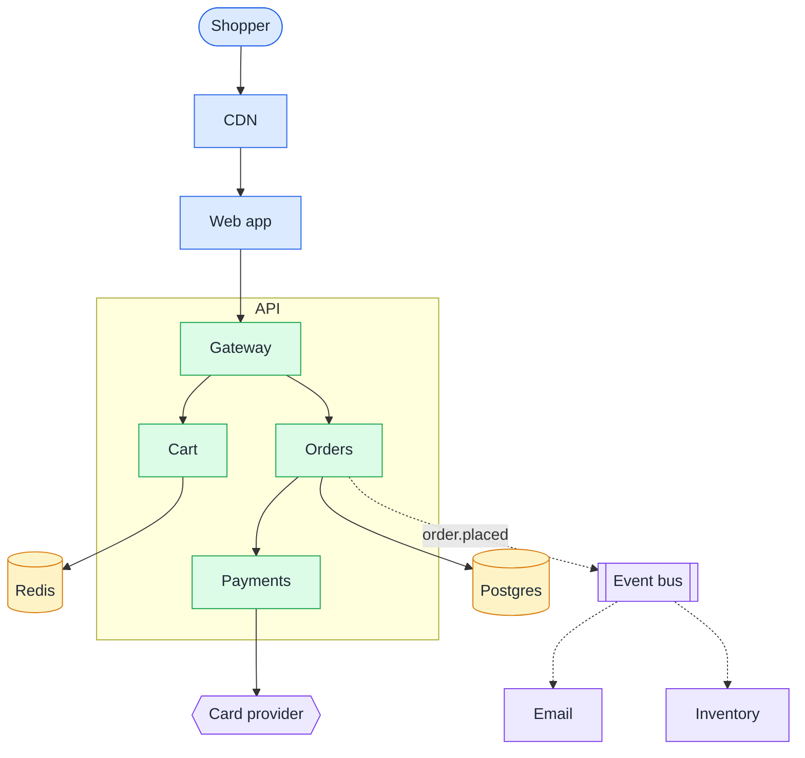

# Checkout architecture

```mermaid
flowchart TB
  user([Shopper]) --> cdn[CDN]
  cdn --> web[Web app]
  subgraph api [API]
    gw[Gateway] --> cart[Cart]
    gw --> orders[Orders]
    orders --> pay[Payments]
  end
  web --> gw
  cart --> cache[(Redis)]
  orders --> db[(Postgres)]
  pay --> psp{{Card provider}}
  orders -. "order.placed" .-> bus[[Event bus]]
  bus -.-> mail[Email]
  bus -.-> stock[Inventory]
  classDef client fill:#dbeafe,stroke:#2563eb,color:#1f2937
  classDef service fill:#dcfce7,stroke:#16a34a,color:#1f2937
  classDef store fill:#fef3c7,stroke:#d97706,color:#1f2937
  classDef ext fill:#ede9fe,stroke:#7c3aed,color:#1f2937
  class user,cdn,web client
  class gw,cart,orders,pay service
  class cache,db store
  class psp,bus,mail,stock ext
```
