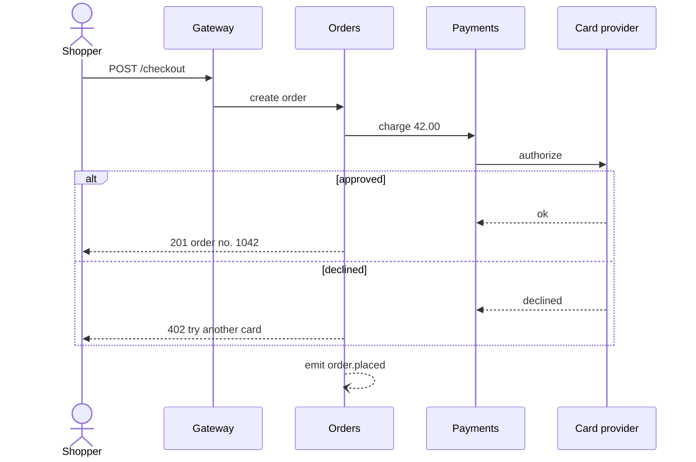

# Place an order

```mermaid
sequenceDiagram
  actor S as Shopper
  participant G as Gateway
  participant O as Orders
  participant P as Payments
  participant C as Card provider
  S->>G: POST /checkout
  G->>O: create order
  O->>P: charge 42.00
  P->>C: authorize
  alt approved
    C-->>P: ok
    O-->>S: 201 order no. 1042
  else declined
    C-->>P: declined
    O-->>S: 402 try another card
  end
  O--)O: emit order.placed
```
